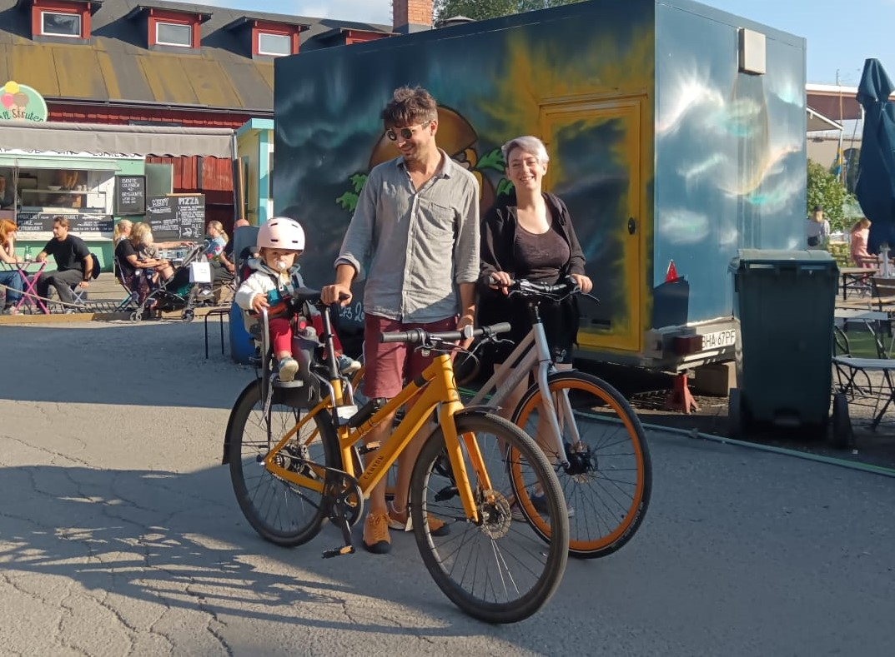

Hi, I'm Gabriele, a Stockholm based researcher and developer currently working as a machine learning engineer in the medical images team at RaySearch Laboratories, where we develop software for cancer treatment. I'm interested in the whole spectrum of machine learning, from the theoretical foundations to the applications, and I have an academic background in discrete geometry and computational mathematics.

I periodically end up doing some research, see my [academic page](/research). 

If you want to get in touch with me you can either add me on [LinkedIn](https://www.linkedin.com/in/gabriele-balletti/) or just use my personal mail `gabriele . balletti at gmail dot com`.

