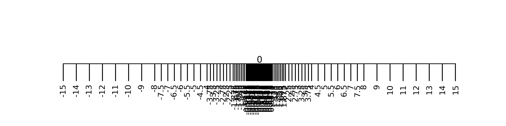

As Donald E. Knuth puts it in his second volume of *The Art of Computer Programming* "Every well-rounded programmer ought to have a knowledge of what goes on during the elementary steps of floating point arithmetic". Despite I would be totally justified, not being a well-rounded programmer at all, I still decided to look a bit into the topic, rewriting some of my notes in this post. The subject turned out to be surprisingly interesting and full of smart ideas. Beside Knut's second volume of TAOCP, I also found an amazing source in David Goldberg's paper [*What Every Computer Scientist Should Know About Floating-Point Arithmetic*](https://docs.oracle.com/cd/E19957-01/806-3568/ncg_goldberg.html). As you can see they are quite insistent on the fact that people should know more about it.

## Basic definitions

The term floating refers to the fact that the radix of a number (i.e. what separates its integer and the fractional part, could be a comma or a point, depending of where you live) is not in a determined position, in opposition to the standard fixed point arithmetic. From a mere computational point of view most of floating point numbers manipulations computers do will be slower than their fixed point counterparts, and even with basic operations it is very easy to lose exactness. On the other hand floating point numbers can describe quantities which are *meaningful* to us with an acceptable degree of error. Extreme quantities as Plank's constant or Avogadro's number can be stored as *floats* with a better precision than what we are used to read on school textbooks using, most of the times, as much computer memory as we need to store a four letters word. Even better, the imprecision floating point numbers inherently carry can be precisely predicted.

Floating point numbers are a finite subset of the rational numbers. Which numbers are floating point depends on certain parameters that need to be fixed, but fixing these parameters will not affect the general properties of this set. These parameters are
 - a *base* $\beta$,
 - two integers $e_{min}$ and $e_{max}$,
 - a *precision* integer $p$.

A rational number $x$ is a *floating point number* if there exists a triple $(s, e, f)$ where
 - $s \in \{0, 1\}$ is the *sign* of $x$,
 - $e$, the *exponent* of $x$ is an integer such that $e_{min} \leq e \leq e_{max}$
 - $f$, the *significand* (or *fraction*) of $x$, is a rational number which can be expanded as $f = \sum_{i = 0}^{p-1} x_i \beta^{-i} $ in base $\beta$,

such that

$$
    x = (-1)^s \beta^e \sum_{i = 0}^{p-1} x_i \beta^{-i}
$$

Sometimes $f$ is also called the *mantissa* of $x$, but Knuth calls this an abuse of notation and I do not dare objecting this.

The definition above is more intimidating than its actual meaning: if we pick $\beta = 10$, and $x$ to be Avogadro's number, then its expansion as a floating point number becomes what we usually call *scientific notation* of a number, which in this case will be

$$ x = 6.02214076 \cdot 10^{23}.$$

Note that in this example I also picked $p$ to be $9$ so that the representation would be both compact and exact (that is due to [a very recent redefinition on what a mole is](https://en.wikipedia.org/wiki/2019_redefinition_of_the_SI_base_units), which is a very interesting little fact).

From the definitions it follows immediately that floating point numbers are a finite set of rational numbers with a power of $\beta$ as denominator. We can even be more precise: there are $2$ possible signs, $e_{max}-e_{min}+1$ possible exponents and $\beta^p$ possible significand, this means that there are

$$ 2 \cdot (e_{max}-e_{min}+1) \cdot \beta^p $$

possible representations of floating point numbers. Note that a floating point number might have different representations, such as $0.1 \cdot 10^0 = 1.0 \cdot 10^{-1}$. This means that the number above is just an upper bound for the actual number of floating point numbers.

If we want to store a floating point number on memory, and supposing we want to keep information about sign, exponent and significant in separate bits, then we can do so in 

$$ 1 + [\log_2(e_{max}-e_{min}+1)] + [p \log_2 (\beta)]$$

bits. As you can imagine, it is common to pick $\beta = 2$ when talking about actual implementations, in this way we we can use the the following handy, and more familiar, *internal representation*.

$$
\begin{array}{ccc}
    \begin{array}{|c|}
        \hline
        \pm \\\
        \hline
    \end{array}
    &
    \begin{array}{|c|c|c|c|c|}
        \hline
    e & e & \cdots & e & e \\\
        \hline
    \end{array}
    &
    \begin{array}{|c|c|c|c|c|}
        \hline
    f & f & \cdots & f & f \\\
        \hline
    \end{array}
    \\\
    \text{sign} & \text{exponent} & \text{significand} \\\
    {\scriptsize \text{$1$ bit}} & {\scriptsize \text{$[\log_2(e_{max}-e_{min}+1)]$ bits}} & {\scriptsize \text{$p$ bits}}
\end{array}
$$

### The lack of an algebraic structure

Floating point arithmetic is inexact. This is a vague statement, meaning that floating points numbers do not have any recognizable algebraic structure with their basic operations. Other sets such as the real or rational numbers are *fields* under addition and multiplication - which is basically [as good as it gets](https://en.wikipedia.org/wiki/Field_(mathematics)) for a mathematician -, but floats do not even form a semigroup under addition as their sum is not associative (we will see this in the example below). The idea to bring home here is that most of the calculations between floating point numbers produce quantities that must be rounded in order to ``snap'' as a floating point number, thus their algebraic structure is sacrificed. The mathematician's take here is that we are we cannot have finiteness and characteristic zero.

In this post we will not give exact definitions of the arithmetic operations as they may vary depending on the actual implementation. Even some of the standards the implementations are based on leave some wiggle room for the definitions of floating point arithmetic, focusing rather on properties they should satisfy. Here we do something similar, showing that the aforementioned inexactness of floating point arithmetic cannot really be avoided, regardless of the actual implementation.

When it comes to basic operations, such as addition, subtraction, multiplication and division, one approach would be to inherit them verbatim from the real or rational numbers. If $x$ and $y$ are two floats, one can calculate $x + y$ as an exact sum of rational numbers and then round it up or down to a floating point number. But since floating-point calculations have rounding error anyway, we might as well define the basic arithmetic operations with built-in rounding errors, provided that we gain in efficiency and speed. Basically, instead of calculating $\mathrm{round}(x + y)$, where $\mathrm{round}$ is a rounding function which snaps a rational number to the closest floating point number, we would rather define an entirely new addition, which we represent with the sign $\oplus$, such that $x \oplus y$ is a good approximation of $\mathrm{round}(x + y)$. A safe way to think about floating point addition is the standard bitwise fixed point addition with a preventive alignment of the radix. Analogously we will use the symbols $\ominus$, $\otimes$ and $\oslash$ for floating point subtraction, multiplication and division respectively.

Properties such as $x \oplus y = y \oplus x$ or $ x \ominus y = x \oplus -y$ will be valid in most floating point arithmetic implementations, on the other hand the associative law always breaks downs: it is not true that

$$
(x \oplus y) \oplus z = x \oplus (y \oplus z)
$$

for all $x, y, z$. Examples can be easily built exploiting overflow and underflow errors, or, as in the following example, using the fact that adding a large and a small number causes a loss of data. 

#### Example
Let $\beta = 2 $, $p = 2 $, $e_{min} = 0 $ and $e_{max} = 1$. Then

$$
{\scriptsize
    \bigl(
    \begin{array}{|c|}   \hline +   \\\ \hline \end{array} \enspace
    \begin{array}{|c|}   \hline 1     \\\ \hline \end{array} \enspace
    \begin{array}{|c|c|} \hline 1 & 0 \\\ \hline \end{array}
    \oplus
    \begin{array}{|c|}   \hline +   \\\ \hline \end{array} \enspace
    \begin{array}{|c|}   \hline 0     \\\ \hline \end{array} \enspace
    \begin{array}{|c|c|} \hline 0 & 1 \\\ \hline \end{array}
    \bigr)
    \oplus
    \begin{array}{|c|}   \hline -   \\\ \hline \end{array} \enspace
    \begin{array}{|c|}   \hline 0     \\\ \hline \end{array} \enspace
    \begin{array}{|c|c|} \hline 1 & 1 \\\ \hline \end{array}
    =
    \begin{array}{|c|}   \hline +   \\\ \hline \end{array} \enspace
    \begin{array}{|c|}   \hline 1     \\\ \hline \end{array} \enspace
    \begin{array}{|c|c|} \hline 1 & 0 \\\ \hline \end{array}
    \oplus
    \begin{array}{|c|}   \hline -   \\\ \hline \end{array} \enspace
    \begin{array}{|c|}   \hline 0     \\\ \hline \end{array} \enspace
    \begin{array}{|c|c|} \hline 1 & 1 \\\ \hline \end{array}
    =
    \begin{array}{|c|}   \hline +   \\\ \hline \end{array} \enspace
    \begin{array}{|c|}   \hline 0     \\\ \hline \end{array} \enspace
    \begin{array}{|c|c|} \hline 0 & 1 \\\ \hline \end{array}
}
$$

but 

$$
{\scriptsize
    \begin{array}{|c|}   \hline +   \\\ \hline \end{array} \enspace
    \begin{array}{|c|}   \hline 1     \\\ \hline \end{array} \enspace
    \begin{array}{|c|c|} \hline 1 & 0 \\\ \hline \end{array}
    \oplus
    \bigl(
    \begin{array}{|c|}   \hline +   \\\ \hline \end{array} \enspace
    \begin{array}{|c|}   \hline 0     \\\ \hline \end{array} \enspace
    \begin{array}{|c|c|} \hline 0 & 1 \\\ \hline \end{array}
    \oplus
    \begin{array}{|c|}   \hline -   \\\ \hline \end{array} \enspace
    \begin{array}{|c|}   \hline 0     \\\ \hline \end{array} \enspace
    \begin{array}{|c|c|} \hline 1 & 1 \\\ \hline \end{array}
    \bigr)
    =
    \\\
    \begin{array}{|c|}   \hline +   \\\ \hline \end{array} \enspace
    \begin{array}{|c|}   \hline 1     \\\ \hline \end{array} \enspace
    \begin{array}{|c|c|} \hline 1 & 0 \\\ \hline \end{array}
    \oplus
    \begin{array}{|c|}   \hline -   \\\ \hline \end{array} \enspace
    \begin{array}{|c|}   \hline 0     \\\ \hline \end{array} \enspace
    \begin{array}{|c|c|} \hline 1 & 0 \\\ \hline \end{array}
    = 
    \begin{array}{|c|}   \hline +   \\\ \hline \end{array} \enspace
    \begin{array}{|c|}   \hline 0     \\\ \hline \end{array} \enspace
    \begin{array}{|c|c|} \hline 1 & 0 \\\ \hline \end{array}
}
$$

In the example above we assumed that $\oplus$ rounds to the nearest floating number when precision is exceeded, and if the number falls midway, it rounds to the nearest value with an even least significant digit. This rounding is called *round half to even*, which, as we will see in a follow-up post, is the standard way of rounding floating point numbers. Even without attempting to give a formal proof, one can realize that for any implementation trying to approximate the behavior of rational number this kind of trap is not really avoidable, and the finite precision is to be blamed.

Not having associativity is a big deal. We are used to notations such as $x + y + z$ as they are based on the assumption of associativity, while in the context of floating point it should be clear that parentheses matter.

### Distribution of floating point numbers

As we noted above, the same floating point number can have different representations. One could try to pick a ``representative'' representation for each possible nonzero number is by requiring the leading digit $x_0$ of the significand to be non-zero. We call *normalized* such representations. When the number is zero then we call normalized its representation where the exponent is as small as possible, i.e. $f = 0$ and $e = e_{min}$. The problem with this definition is that there might be floating point numbers not having a normalized representation. Indeed the condition $x_0 \neq 0$ minimizes the exponent $e$, but its lower limit $e_{min}$ might prevent a floating point number to have a normal form. An instance of this behavior can be observed in the following example.

#### Example 
Let $\beta = 2 $, $p = 2 $, $e_{min} = 0 $ and $e_{max} = 1$. Then there exist $16$ representations of non-zero floating point numbers, of them only the following eight are normalized.

$$
{\small
\begin{array}{cccc}
    \begin{array}{c}
        \begin{array}{|c|}   \hline +   \\\ \hline \end{array} \enspace
        \begin{array}{|c|}   \hline 0     \\\ \hline \end{array} \enspace
        \begin{array}{|c|c|} \hline 1 & 0 \\\ \hline \end{array}
    \end{array}
    &
    \begin{array}{c}
        \begin{array}{|c|}   \hline +   \\\ \hline \end{array} \enspace
        \begin{array}{|c|}   \hline 0     \\\ \hline \end{array} \enspace
        \begin{array}{|c|c|} \hline 1 & 1 \\\ \hline \end{array}
    \end{array}
    &
    \begin{array}{c}
        \begin{array}{|c|}   \hline +   \\\ \hline \end{array} \enspace
        \begin{array}{|c|}   \hline 1     \\\ \hline \end{array} \enspace
        \begin{array}{|c|c|} \hline 1 & 0 \\\ \hline \end{array}
    \end{array}
    &
    \begin{array}{c}
        \begin{array}{|c|}   \hline +   \\\ \hline \end{array} \enspace
        \begin{array}{|c|}   \hline 1     \\\ \hline \end{array} \enspace
        \begin{array}{|c|c|} \hline 1 & 1 \\\ \hline \end{array}
    \end{array}
    \\\
    \begin{array}{c}
        \begin{array}{|c|}   \hline -   \\\ \hline \end{array} \enspace
        \begin{array}{|c|}   \hline 0     \\\ \hline \end{array} \enspace
        \begin{array}{|c|c|} \hline 1 & 0 \\\ \hline \end{array}
    \end{array}
    &
    \begin{array}{c}
        \begin{array}{|c|}   \hline -   \\\ \hline \end{array} \enspace
        \begin{array}{|c|}   \hline 0     \\\ \hline \end{array} \enspace
        \begin{array}{|c|c|} \hline 1 & 1 \\\ \hline \end{array}
    \end{array}
    &
    \begin{array}{c}
        \begin{array}{|c|}   \hline -   \\\ \hline \end{array} \enspace
        \begin{array}{|c|}   \hline 1     \\\ \hline \end{array} \enspace
        \begin{array}{|c|c|} \hline 1 & 0 \\\ \hline \end{array}
    \end{array}
    &
    \begin{array}{c}
        \begin{array}{|c|}   \hline -   \\\ \hline \end{array} \enspace
        \begin{array}{|c|}   \hline 1     \\\ \hline \end{array} \enspace
        \begin{array}{|c|c|} \hline 1 & 1 \\\ \hline \end{array}
    \end{array}
\end{array}
}
$$

Now consider the number $ x = 0.1 \cdot 2^0$, note that its representation

$$
{\small
    \begin{array}{c}
        \begin{array}{|c|}   \hline +   \\\ \hline \end{array} \enspace
        \begin{array}{|c|}   \hline 0     \\\ \hline \end{array} \enspace
        \begin{array}{|c|c|} \hline 0 & 1 \\\ \hline \end{array}
    \end{array}
}
$$

is unique, as there setting $x_0 = 1$ would require $e = -1$ which is below the $e_{min} = 0$ threshold. This means that $x$ does not have a normalized representation.

---

This splits the floating point numbers in two categories. We call *normal* the numbers having a normalized representation and *subnormal* (or *denormal*) those not having a normalized representation. There are good reasons not to include subnormals to a floating point implementation, as we would gain speed and uniformity. On the other hand suppose you want to calculate the following operation

$$
{\small
    \begin{array}{c}
        \begin{array}{|c|}   \hline +   \\\ \hline \end{array} \enspace
        \begin{array}{|c|}   \hline 0     \\\ \hline \end{array} \enspace
        \begin{array}{|c|c|} \hline 1 & 1 \\\ \hline \end{array}
    \end{array}
    -
    \begin{array}{c}
        \begin{array}{|c|}   \hline +   \\\ \hline \end{array} \enspace
        \begin{array}{|c|}   \hline 0     \\\ \hline \end{array} \enspace
        \begin{array}{|c|c|} \hline 1 & 0 \\\ \hline \end{array}
    \end{array}
},
$$

then, if we do not allow subnormals, the operation *underflows* and the results needs to be flushed to zero. In other words, if we stick to normals only, we lose the property $x = y \iff x - y = 0$. This is one of the main reasons modern standards always include subnormals.

Now that normals and subnormals have been defined, we have appropriate tools to discuss what is maybe the most flashing and immediate property of floating point numbers: they are not evenly distributed on the real line. In a an hypothetical implementation of the floating point arithmetic with three bits for both mantissa and exponent, the distribution of floats is represented by the picture below ([source](https://github.com/gabrieleballetti/floating-point-charts/blob/main/floats_distribution.py)).

Being a finite [totally ordered](https://en.wikipedia.org/wiki/Total_order) set there is a notion of successive of a floating point number $x$, but how far is that number from $x$ will depend on how large $x$ is. The farther from zero, the larger the gap between two consecutive floats is. More precisely, if a floating number $x$ satisfies $\beta^e \leq \lvert x \rvert \le \beta^{e+1}$ for some exponent $e$, the gap between $x$ and its successive will be

$$\beta^{\max(e_{} , e_{min}) - p + 1}.$$

This quantity is usually called *unit in the last place* or *unit of least precision* of $x$, and denoted with $\mathrm{ULP}(x)$. Note that $\mathrm{ULP}$ is minimized by subnormals (for which it equals $\beta^{e_{min} - p + 1}$ and once among the normals it grows by a factor of $\beta$ at every power of $\beta$.

There are many details I intentionally skipped or unintentionally missed. NaNs, signed zeros and division by zero are some examples. They would actually invalidate some of the mathematical terms I used, but at the same time I regard them mostly as implementation details, while I tried to keep this post standards-agnostic. The standards used in actual implementations are still very interesting and important to know, especially when actually writing code, so they will be part of a follow up post.